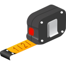

# SEMMY

This is the repository for the SEM picture analyzer SEMMY. The Goal ist too simplify and accelerate the measurements of nano-structures.

## Functionality

<!-- Add image of program -->

### Load Images
Supports all image formats supported by opencv.

### SEM-Profiles

### Automatic-Scaling
Automatic Detection of Scaling bar. Just select the tool *identify scaling* and click on the scale bar. 
SEM-Profiles store location of scale bar for even easier readout.

### Various Measurement Tools
There are several Tools available to measure your structures.

- Line
- Rectangle
    - Square (by pressing Ctrl)
- Ellipse
    - Circle (by pressing Ctrl)

#### Line
Measure the distance between 2 Points.

#### Rectangle

#### Circle

## Running

To compile this project it is advised to use pyinstaller. First create an empty miniconda environment

    conda create -n semmy
    conda activate semmy

Then install the semmy package

    pip install .

To run Semmy simply 

    python run.py

### Running tests

To run tests you will need to install pytest as well

    pip install pytest

Then, simply calling pytest will run the tests

    pytest     
    #or
    python -m pytest

## Compiling

To compile the project you first have to go through all steps that are needed for running it.
Then you will have to install pyinstaller. Install it via pip or conda

    # pip install pyinstaller # I have not tried this but should work too
    conda install -c conda-forge pyinstaller

Finally, run the compiling script which calls pyinstaller

    python compile.py

