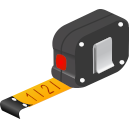

# Measury


[](https://github.com/ullmannJan/measury/actions/workflows/pytest.yml)




Measury is a measurement tool for microscope images. The goal ist to simplify and accelerate the measurements of structures from images.

## Functionality

<!-- Add image of program -->


### Load Images
Supports all image formats supported by ```opencv```.

### Automatic Scaling Bar Detection
Automatic Detection of Scaling bar. Just select the tool *identify scaling* and click on the scale bar. 
Microscope profiles can store locations of scale bar for certain types of microscopes for easier detection.

### Moving/Handling
You can move the image by dragging the mouse wheel or by selecting *move* mode

### Various Measurement Tools
There are several Tools available to measure your structures.

- Select (select objects without changing them)
- Line
- Rectangle
    - Square (by pressing Ctrl)
- Ellipse
    - Circle (by pressing Ctrl)
- Angle

## Running

First create an empty miniconda environment

    conda create -n measury
    conda activate measury

Then install the measury package

    pip install .

To run Measury simply 

    python run.py

### Running tests

To run tests you will need to install pytest as well

    pip install pytest

Then, simply calling pytest will run the tests

    pytest     
    #or
    python -m pytest


## Compiling

To compile this project it is advised to use ```pyinstaller```. 
> It is important to use Pyinstaller >= 6.0.0

This guides you through all steps that are needed for running it.
First, ```pyinstaller``` should be installed via pip or conda

    pip install pyinstaller 
    # or with conda
    conda install -c conda-forge pyinstaller

Finally, run the compiling script which calls pyinstaller

    python compile.py

This will result in a folder ```dist``` where the compiled project will be placed.

The ```compile.py``` script has the option to create a compressed .zip file of the project. You can set 

    zipped = True

to achieve this behavior.

